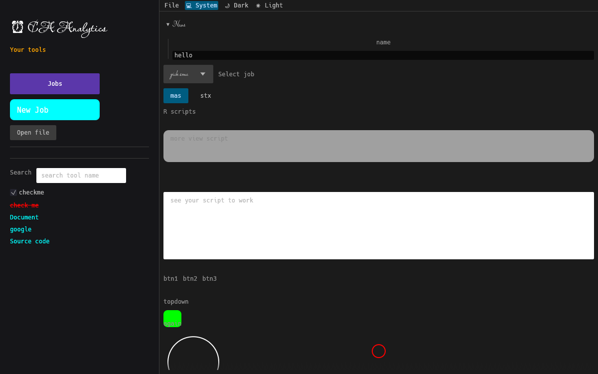

**Usage**   
   

**Sys deps**    
```bash
for pkg in libgtk-3-0 libgtk-3-dev\ 
  libx11-dev libxcb1-dev libxrandr-dev libxi-dev libxcursor-dev libxcb-render0-dev libxcb-shape0-dev libxcb-xfixes0-dev libssl-dev\ 
  libwayland-dev libxkbcommon-dev libxkbcommon-x11-0; do
  dpkg -s "$pkg" &>/dev/null && echo "OK      $pkg" || echo "MISSING $pkg"
done
```

**Learning materials**  
[egui: note](https://www.youtube.com/watch?v=hGsqR3DK5Do)  
[egui: img](https://www.youtube.com/watch?v=m4iwY8di9DA)   
[egui: svg](https://www.youtube.com/watch?v=DJVKNRN5avo)   
[egui: game](https://www.youtube.com/watch?v=7Cf1oqOi1js&t=497s)   
[egui: rss](https://www.youtube.com/watch?v=1sPXcgonffQ)   
[egui: news](https://www.youtube.com/watch?v=NtUkr_z7l84)   
[egui: plot](https://www.youtube.com/watch?v=OSEf-z0qTFE&t=1s)   
[egui: plot](https://www.youtube.com/watch?v=zUvHkkkrmIY&t=1438s)   

